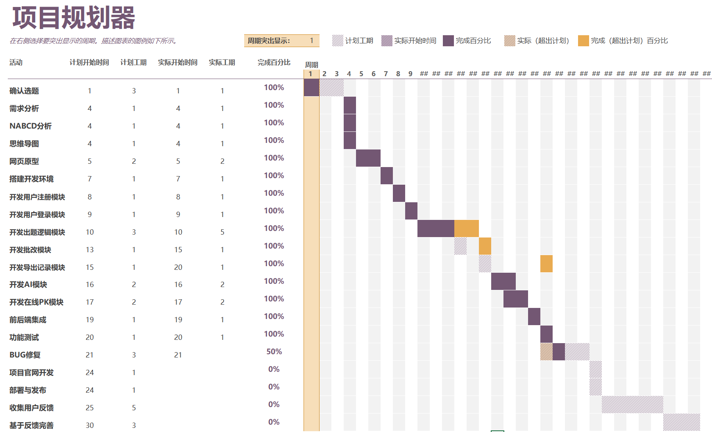

# 软件工程

## 分工

- 卢瑞：负责前端实现
- 蓝辰君：负责后端实现
- 项恩奇：组长，负责原型设计，协助前后端实现
- 马哲禹：负责需求分析、测试，后端开发

## NABCD模型分析

- N：需求
  - 小明的妈妈近期很郁闷，小明上小学后，老师要求每天完成 30 道口算题，每天出题改题成了一个大负担，“有个可以出题的软件就好了”小明妈妈这么想。
  - 同样，存在许多家长有出题需求，因此推出该Web，用于习题生成，解决出题问题。
- A: 做法
  - 技术
    - 在网页实现自动出题，支持选择学生年级、题型、出题数量
    - 实现批改功能
    - 加入计时功能，到时自动批改
    - 网页也有查看答案功能，批改后显示答案
    - 另加一按钮用于下载习题以及答案
    - 新增错题集
    - 新增AI功能
      - 聊天
      - 学情分析
      - 讲解错题
      - 智能出题
    - 新增在线PK
  - 商业模式
    - 免费，无广告。
- B：好处
  - 该Web可以分年级分题型自动出题，改题，并记录分数
  - 基于用户反馈改进
  - 移动端专门的ui设计
  - 积极加入新功能
- C：竞争
  - 自动批改、支持保存题目
  - 加入ai功能
  - AI出题
  - 在线PK
- D：推广
  - 初期通过个人人脉推广
  - 获取一定反馈后，对Web改进，开始网络推广
    - 与教育机构合作
    - 创建微信公众号宣传
    - 适当投放广告

## 需求分解

- 宏观
  - 小明上小学后，老师要求每天完成 30 道口算题。因此推出该Web，用于自动出题，改题，并记录分数
  - 小明现在一年级，小明妈妈希望买一个软件可以用三年的。因此该Web出题至少涵盖小学一年级到三年级的题型
  - 基于便携性需求，推出移动端网页
  - 要求有项目官网，用于介绍网站
- 微观
  - 项目官网
    - 项目介绍
    - 小组成员介绍及分工
    - 联系方式（用户反馈渠道）
  - 出题网站
    - 要求有登录、注册功能
    - 要求出题可选年级、题型、数量
    - 要求有计时功能，到时自动批改
    - 要求有批改功能
    - 要求有下载题目及答案功能
    - 新增：添加ai出题功能，不局限于数学口算
    - 新增：邀请朋友在线pk
    - 新增错题集

## 任务细分

- NABCD分析：马哲禹
- 需求分解与任务划分：马哲禹
- 思维导图：项恩奇
- 移动端网页原型：项恩奇
- 开发用户注册模块
  - 前端：卢瑞
  - 后端：蓝辰君
- 开发用户登录模块
  - 前端：卢瑞
  - 后端：蓝辰君
- 数据库部署：蓝辰君
- 开发出题题型选择模块
  - 一年级：蓝辰君
  - 二年级：蓝辰君
  - 三年级：蓝辰君
  - 四年级：项恩奇
  - 五年级：项恩奇
  - 六年级：项恩奇
- 开发批改与计时功能模块：蓝辰君
- 开发题目与答案下载功能模块：马哲禹
- 开发错题集板块：马哲禹
- 整合逻辑，实现前端页面：卢瑞
- 开发AI模块
  - 聊天：马哲禹
  - 学情分析：马哲禹
  - 讲解错题：马哲禹
  - AI出题：马哲禹
- 开发在线PK功能
  - 前端：卢瑞
  - 后端：卢瑞
- 新增头像功能
  - 前端页面调整：卢瑞
  - 后端实现：马哲禹
- 功能测试：马哲禹
- 编写用户手册：项恩奇
- 项目官网开发：项恩奇
- 部署与发布
- 收集用户反馈
- 基于反馈修改功能

## 记录

- 思维导图
  - 
- 页面原型
  - 移动端
    - 
- 甘特图
  - 10月15日记录如下
    - 
  - 11.05
    - 
- 10.25 初步完成后端开发(注册、登录、出题、改题)
- 10.26 初步完成前端页面
- 10.27 前后端联调测试
- 11.01 前后端开发错题集模块完成
- 10.30 前后端开发AI模块完成
- 11.01 前后端开发pk模块完成
- 11.02 新增头像功能
- 11.03 新增导出功能
- 11.04 优化前端页面
